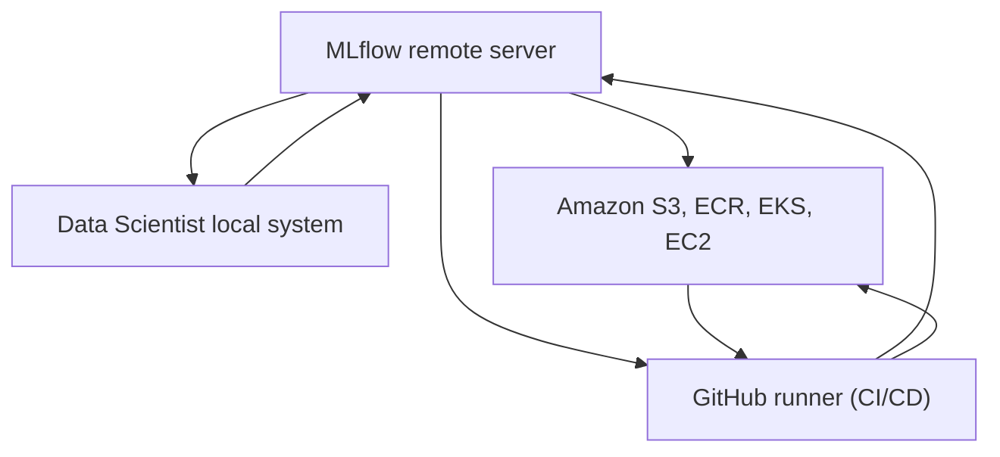
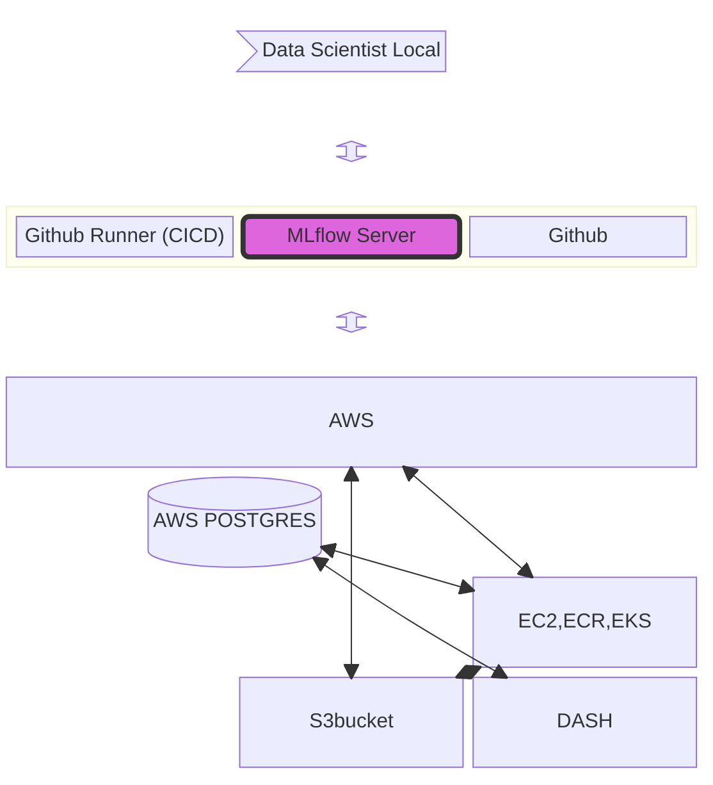

# Pio-NER

This is a proposal walkthrough. For notebook walk through please open main_notebook.ipynb

Publicis sapient Input-to-Ouput Named Entity Recognition is a platform that will help our customers to extract insights from Natural Language. 

While the name has Named Entity Recognition in it, it is well versed with multiple tasks such as: 
1. Text2SQL
2. POS tagging
3. NER tagging 
4. Ticketing Agent and much more!

We will today dive into NER tagging functionality of the same. 

1. Read the sentences from OLAP (postgres) & OLTP (data-lake) database. 
2. Run them through inference pipeline. 
3. Store the results back in the database

NER Architecture

