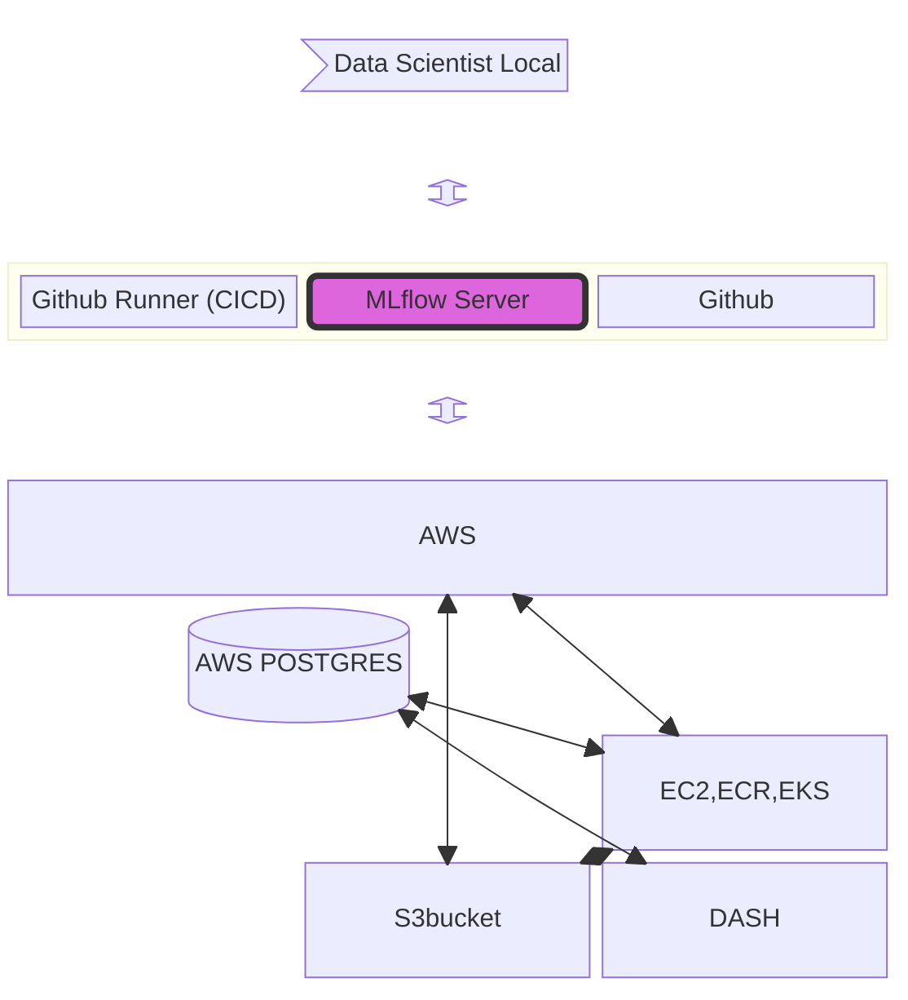

# Pio-NER

This is a proposal walkthrough. For notebook walk through please open main_notebook.ipynb

Publicis sapient Input-to-Ouput Named Entity Recognition is a platform that will help our customers to extract insights from Natural Language. 

While the name has Named Entity Recognition in it, it is well versed with multiple tasks such as: 
```bash
1. Text2SQL
2. POS tagging
3. NER tagging 
4. Ticketing Agent and much more!
```

We will today dive into NER tagging functionality of the same. 

```bash
1. Read the sentences from OLAP (postgres) & OLTP (data-lake) database. 
2. Run them through inference pipeline. 
3. Store the results back in the database.
4. Monitor the results through Dash (In super flexible way)
```
Proposed Architecture (PipeLine Workflow explained below)




How the entire pipeline works:
1. Data Scientists will ssh into remote system (running MLFLOW server) through Visual Studio Code. 
2. Will create their own version of notebooks and run experiments (in super flexible way)
3. Once they are happy with the results, will copy the run_id and past it in the dockerfile.
4. This will trigger a CICD pipeline that will psuh the Docker to ECR and deploy this container through EKS.
5. Once live, inference pipeline will run predictions and store results in POSTGRES. (Input data will be read from postgres as well) 
6. This data will then be monitored using customised plots powered by DASH.


